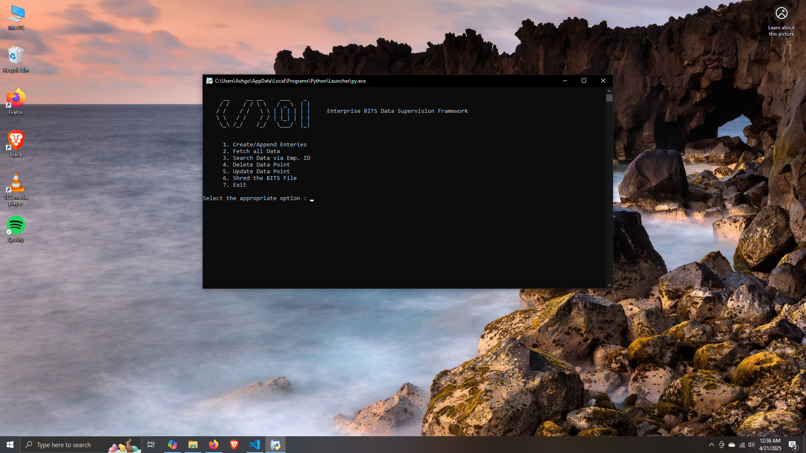
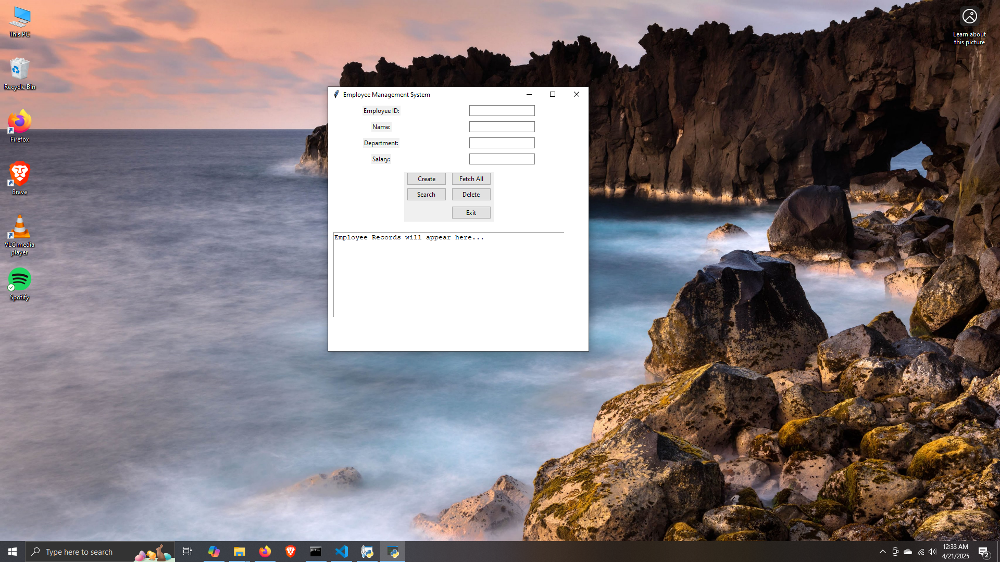

#  EmployeeBin-py

**_A Python-based tool utilizing the pickle library to create `.dat` files._**  
Take it with a pinch of salt—this is a school project exploring serialization with Python!

---

## Features
- Uses Python's built-in `pickle` library for serializing and deserializing Python objects.
- Creates `.dat` files for storing data.
- [Add any additional features or functionality here.]

---

## Installation and Setup
To run the program:
1. Ensure you have Python installed on your system.  
2. Clone this repository to your local machine:  
   git clone https://github.com/UnknownHuman2/EmployeeBin-py
## CLI

## GUI-Testing

